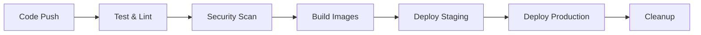

# 🚀 Deployment Guide - Autonomous SDLC Agent Platform

This guide covers deploying the Autonomous SDLC Agent Platform using Docker, Kubernetes, and Helm with comprehensive CI/CD pipeline.

## 📋 Prerequisites

### Required Tools
- **Docker** 20.10+
- **Kubernetes** 1.24+
- **Helm** 3.8+
- **kubectl** configured for your cluster

### Cloud Requirements
- **Kubernetes Cluster** (EKS, GKE, AKS, or on-premises)
- **Container Registry** (GitHub Container Registry included)
- **DNS Management** for custom domains
- **SSL Certificates** (cert-manager automated)

## 🐳 Docker Deployment

### Quick Start with Docker Compose
```bash
# Clone the repository
git clone https://github.com/asshat1981ar/autonomous-sdlc-agent.git
cd autonomous-sdlc-agent

# Start all services
docker-compose up -d

# Access the platform
open http://localhost
```

### Individual Container Deployment
```bash
# Build backend
docker build -f docker/Dockerfile.backend -t sdlc-backend .

# Build frontend  
docker build -f docker/Dockerfile.frontend -t sdlc-frontend .

# Run backend
docker run -d -p 5000:5000 --name backend sdlc-backend

# Run frontend
docker run -d -p 80:80 --name frontend sdlc-frontend
```

## ☸️ Kubernetes Deployment

### Method 1: One-Command Deployment
```bash
# Make deployment script executable
chmod +x scripts/deploy.sh

# Deploy to production
./scripts/deploy.sh

# Deploy to staging
ENVIRONMENT=staging ./scripts/deploy.sh
```

### Method 2: Manual Kubernetes Deployment
```bash
# Create namespace
kubectl create namespace sdlc-agent

# Apply base manifests
kubectl apply -f k8s/base/

# Apply environment-specific configs
kubectl apply -f k8s/production/
```

### Method 3: Helm Deployment
```bash
# Add custom values for your environment
cp helm/sdlc-agent/values.yaml my-values.yaml

# Edit my-values.yaml with your configuration

# Install with Helm
helm install sdlc-agent helm/sdlc-agent \
  --namespace sdlc-agent \
  --create-namespace \
  --values my-values.yaml
```

## 🔄 CI/CD Pipeline

### GitHub Actions Workflow

The platform includes a comprehensive CI/CD pipeline that automatically:

1. **Tests** code on multiple Python and Node.js versions
2. **Security scans** with Trivy vulnerability scanner
3. **Builds** and pushes Docker images to GitHub Container Registry
4. **Deploys** to staging on `develop` branch
5. **Deploys** to production on release tags

### Pipeline Stages



### Setting Up CI/CD

1. **Configure Secrets** in your GitHub repository:
   ```
   AWS_ACCESS_KEY_ID
   AWS_SECRET_ACCESS_KEY
   SLACK_WEBHOOK_URL (optional)
   ```

2. **Configure Container Registry**:
   - The pipeline uses GitHub Container Registry (ghcr.io)
   - Images are automatically pushed on successful builds

3. **Environment Configuration**:
   - Staging deploys from `develop` branch
   - Production deploys from release tags
   - Manual approval required for production

## 🛠️ Configuration

### Environment Variables

#### Backend Configuration
```bash
# AI Provider API Keys
GEMINI_API_KEY=your-gemini-key
ANTHROPIC_API_KEY=your-claude-key
OPENAI_API_KEY=your-openai-key
BLACKBOX_API_KEY=your-blackbox-key

# Database
DATABASE_URL=sqlite:///app/database/app.db
REDIS_URL=redis://redis:6379/0

# Security
SECRET_KEY=your-secret-key
SESSION_SECRET=your-session-secret

# Logging
LOG_LEVEL=INFO
SENTRY_DSN=your-sentry-dsn
```

#### Frontend Configuration
```bash
REACT_APP_API_URL=https://your-domain.com
REACT_APP_ENVIRONMENT=production
```

### Kubernetes Secrets

Create secrets for sensitive data:
```bash
# AI Provider secrets
kubectl create secret generic sdlc-secrets \
  --from-literal=GEMINI_API_KEY=your-key \
  --from-literal=ANTHROPIC_API_KEY=your-key \
  --from-literal=OPENAI_API_KEY=your-key \
  --from-literal=BLACKBOX_API_KEY=your-key \
  --namespace sdlc-agent

# Container registry secret  
kubectl create secret docker-registry ghcr-secret \
  --docker-server=ghcr.io \
  --docker-username=your-username \
  --docker-password=your-token \
  --namespace sdlc-agent
```

### Helm Values Customization

Edit `helm/sdlc-agent/values.yaml`:

```yaml
# Custom domain
ingress:
  hosts:
    - host: your-domain.com
      paths:
        - path: /api
          service: backend
        - path: /
          service: frontend

# Resource limits
backend:
  resources:
    requests:
      cpu: 500m
      memory: 512Mi
    limits:
      cpu: 1000m
      memory: 1Gi

# Scaling configuration
backend:
  autoscaling:
    enabled: true
    minReplicas: 3
    maxReplicas: 10
    targetCPUUtilizationPercentage: 70
```

## 📊 Monitoring & Observability

### Prometheus Metrics

The platform exposes metrics for monitoring:
- Request latency and throughput
- AI collaboration success rates
- Resource utilization
- Custom business metrics

### Grafana Dashboards

Pre-configured dashboards include:
- Application performance metrics
- Infrastructure monitoring
- AI agent collaboration analytics
- User session analytics

### Health Checks

Multiple health check endpoints:
```bash
# Backend health
curl https://your-domain.com/api/health

# Frontend health  
curl https://your-domain.com/health

# Kubernetes readiness
kubectl get pods -n sdlc-agent
```

### Log Aggregation

Logs are structured and can be aggregated using:
- **ELK Stack** (Elasticsearch, Logstash, Kibana)
- **Fluentd** or **Fluent Bit**
- **Grafana Loki**

## 🔒 Security Considerations

### Network Security
- **Network Policies** restrict pod-to-pod communication
- **Ingress** with SSL termination
- **Rate limiting** on API endpoints

### Container Security
- **Non-root** containers
- **Read-only** root filesystems
- **Security contexts** with minimal privileges
- **Image scanning** with Trivy

### Secret Management
- **Kubernetes Secrets** for sensitive data
- **External Secrets Operator** for cloud secret managers
- **Sealed Secrets** for GitOps workflows

## 🌍 Multi-Environment Setup

### Environment Structure
```
environments/
├── development/
│   ├── values.yaml
│   └── kustomization.yaml
├── staging/
│   ├── values.yaml
│   └── kustomization.yaml
└── production/
    ├── values.yaml
    └── kustomization.yaml
```

### Environment-Specific Deployments

**Development**:
```bash
helm install sdlc-agent-dev helm/sdlc-agent \
  --namespace sdlc-agent-dev \
  --values environments/development/values.yaml
```

**Staging**:
```bash
helm install sdlc-agent-staging helm/sdlc-agent \
  --namespace sdlc-agent-staging \
  --values environments/staging/values.yaml
```

**Production**:
```bash
helm install sdlc-agent-prod helm/sdlc-agent \
  --namespace sdlc-agent-prod \
  --values environments/production/values.yaml
```

## 🚨 Troubleshooting

### Common Issues

**1. Image Pull Errors**
```bash
# Check registry secret
kubectl get secrets -n sdlc-agent
kubectl describe secret ghcr-secret -n sdlc-agent

# Recreate registry secret
kubectl delete secret ghcr-secret -n sdlc-agent
kubectl create secret docker-registry ghcr-secret \
  --docker-server=ghcr.io \
  --docker-username=your-username \
  --docker-password=your-token \
  --namespace sdlc-agent
```

**2. Backend API Connection Issues**
```bash
# Check backend logs
kubectl logs -f deployment/sdlc-backend -n sdlc-agent

# Check service endpoints
kubectl get endpoints -n sdlc-agent

# Test internal connectivity
kubectl exec -it deployment/sdlc-frontend -n sdlc-agent -- curl http://backend:5000/api/health
```

**3. Ingress Issues**
```bash
# Check ingress controller
kubectl get pods -n ingress-nginx

# Check ingress configuration
kubectl describe ingress sdlc-ingress -n sdlc-agent

# Check DNS resolution
nslookup your-domain.com
```

### Debugging Commands

```bash
# Get all resources
kubectl get all -n sdlc-agent

# Describe problematic pods
kubectl describe pod <pod-name> -n sdlc-agent

# Get detailed logs
kubectl logs <pod-name> -n sdlc-agent --previous

# Execute into container
kubectl exec -it <pod-name> -n sdlc-agent -- /bin/sh

# Port forward for local debugging
kubectl port-forward deployment/sdlc-backend 5000:5000 -n sdlc-agent
```

## 📈 Scaling & Performance

### Horizontal Pod Autoscaling
```yaml
# Already configured in Helm values
backend:
  autoscaling:
    enabled: true
    minReplicas: 3
    maxReplicas: 10
    targetCPUUtilizationPercentage: 70
    targetMemoryUtilizationPercentage: 80
```

### Vertical Pod Autoscaling
```bash
# Install VPA (if available)
kubectl apply -f https://github.com/kubernetes/autoscaler/tree/master/vertical-pod-autoscaler/deploy

# Configure VPA for backend
kubectl apply -f - <<EOF
apiVersion: autoscaling.k8s.io/v1
kind: VerticalPodAutoscaler
metadata:
  name: sdlc-backend-vpa
  namespace: sdlc-agent
spec:
  targetRef:
    apiVersion: apps/v1
    kind: Deployment
    name: sdlc-backend
  updatePolicy:
    updateMode: "Auto"
EOF
```

### Database Scaling
```yaml
# For production, consider managed databases
postgresql:
  enabled: true
  primary:
    persistence:
      size: 100Gi
    resources:
      requests:
        cpu: 1000m
        memory: 2Gi
```

## 🔄 Updates & Maintenance

### Rolling Updates
```bash
# Update backend image
kubectl set image deployment/sdlc-backend backend=ghcr.io/asshat1981ar/autonomous-sdlc-agent/backend:v2.0.0 -n sdlc-agent

# Monitor rollout
kubectl rollout status deployment/sdlc-backend -n sdlc-agent

# Rollback if needed
kubectl rollout undo deployment/sdlc-backend -n sdlc-agent
```

### Backup & Recovery
```bash
# Backup persistent volumes
kubectl get pv
# Use your cloud provider's backup solution

# Export configurations
kubectl get all -n sdlc-agent -o yaml > backup.yaml
```

## 📞 Support

### Getting Help
- **GitHub Issues**: [Report bugs and request features](https://github.com/asshat1981ar/autonomous-sdlc-agent/issues)
- **Discussions**: [Community support](https://github.com/asshat1981ar/autonomous-sdlc-agent/discussions)
- **Documentation**: [Full documentation](README.md)

### Monitoring Health
- **Prometheus**: Monitor metrics and set up alerts
- **Grafana**: Visualize performance and usage
- **Logs**: Centralized logging for debugging

---

**🎉 Your autonomous SDLC platform is ready for enterprise deployment!**